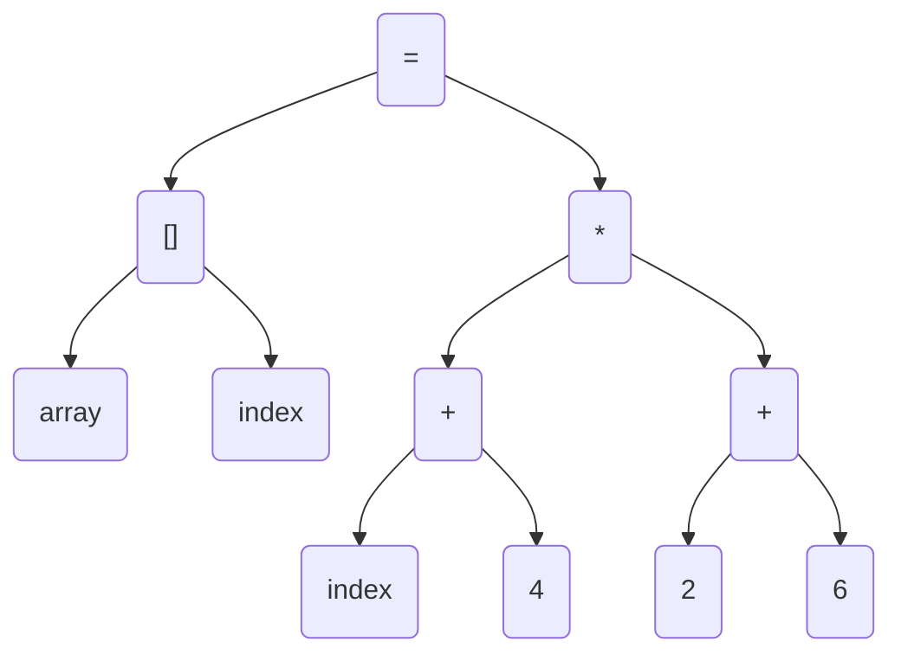

## 预处理
```
gcc -E main.c -o main.i
```
## 编译生成汇编代码
```
gcc -S main.i -o main.s
```
## 源码->汇编
```
gcc -S main.c -o main.s
```
## 汇编生成目标文件
```
as main.s -o main.o 
#或者
gcc -c main.s -o main.o
gcc -c main.c -o main.o
```
## 链接各种库才能产生最终的正确可执行文件
```
#ld命令需要指定所需的目标文件的的路径才能正确生成a.out的可执行文件
ld -static main.o
```
```
#这个会自动链接需要的库并生成a.aout可执行文件
gcc main.o
```

## 编译的过程
假如有如下C代码：
```
array[index] = (index + 4) * (2 + 6)
```
扫描-词法分析-语法分析-语义分析-源代码优化-中间代码代码生成-目标代码生成和优化
词法分析：
词法分析器 lex
这一阶段会将程序分割成一个一个的字符(串)符号忽略空格符，并对分割的字符进行标记分类
关键字、标识符、字面量、特殊符号等

##### 以上代码词法分析的结果如下
| 记号  | 类型|
|-|-|
| array | 标识符 |
| index | 标识符|
| ] | 右方括号|
| = | 赋值|
| ( | 左圆括号|
| index | 标识符|
| + | 加号|
| 4 | 数字|
| ) | 右圆括号|
| * | 乘号|
| ( | 左圆括号|
| 2 | 数字|
| + | 加号|
| 6 | 数字|
| ) | 右圆括号|


语法分析
语法分析器 yacc
根据字符分析的结果，建立一个语法树，一个树结构，树的每一个节点都是一个简单的不能再分割表达式
然后分析各个表达式是否符号规则，否则就报语法错误停止编译


#####  以上代码的语法树
以表达式为节点的树

语法分析


## 链接
链接的主要过程有地址和空间分配、符号决议（符号绑定、地址绑定）、重定位（地址修正）等

## 目标文件
.bss段 存放未初始化的全局变量和局部静态变量，不占用空间
.data段 存放已初始化的全局变量和局部静态变量
.rodata段 存放只读数据如树常量
.text段(.code段) 存放指令代码
总体来说，源程序代码被编译以后主要分成两种段：程序指令和程序数据。代码段数据程序指令，数据段和.bss段属于程序数据。


