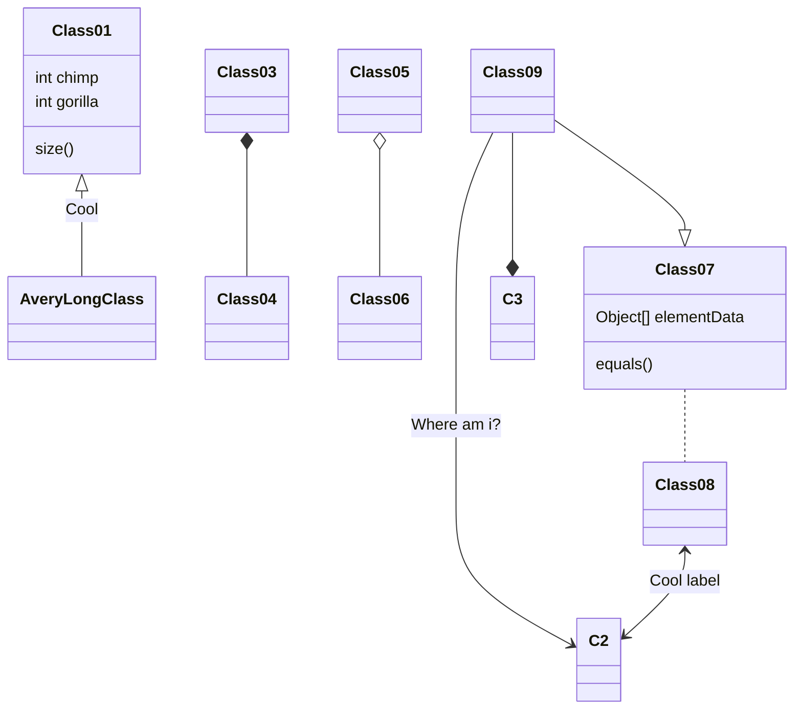
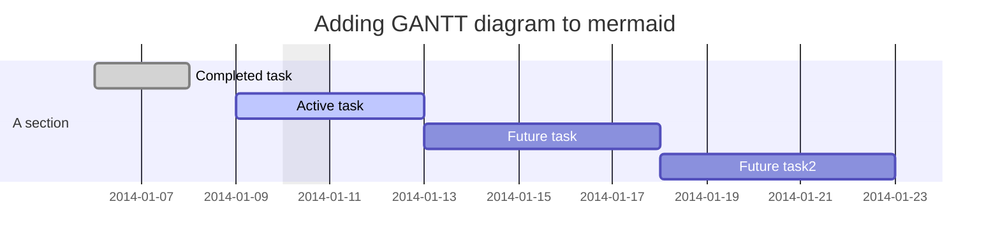
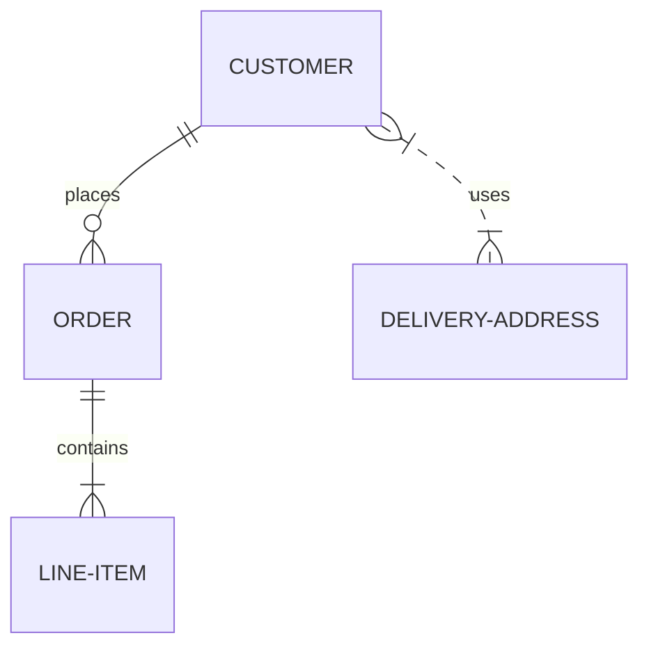
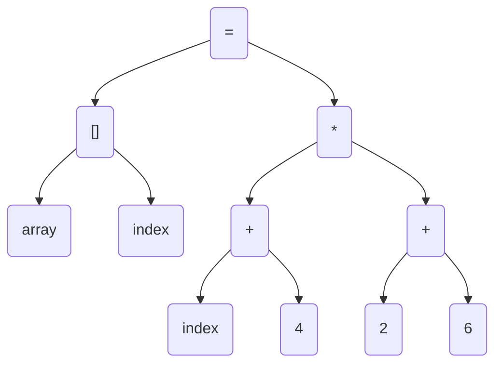
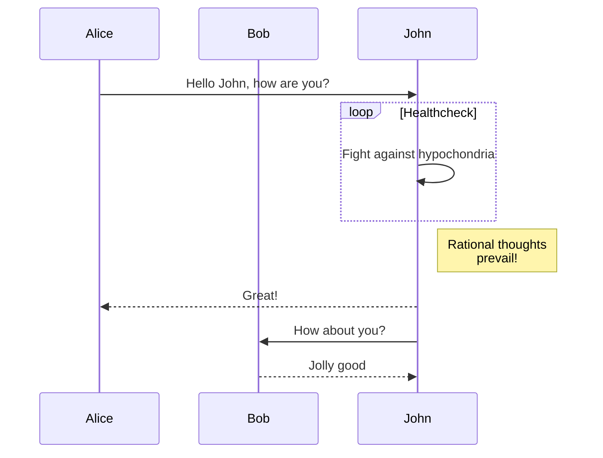
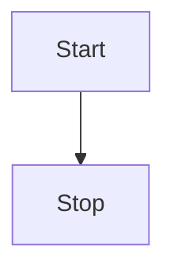
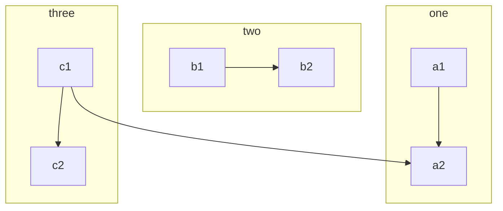

# 基础语法

## 链接
[Markdown语法](https://markdown.com.cn)

## 图片


## 表格

可以使用冒号来定义表格的对齐方式，如下：

| 姓名   | 年龄 |     工作 |
| :----- | :--: | -------: |
| 小可爱 |  18  | 吃可爱多 |
| 小小勇敢 |  20  | 爬棵勇敢树 |
| 小小小机智 |  22  | 看一本机智书 |
## 代码
` curl https://wwww.baidu.com `
## 代码块
```
bash
ls -l
```

## [数学公式](https://github.com/MakerGYT/markdown-it-latex2img)
方程组：
$$
\begin{cases}
3x + 2y  = 7 \\
-6x + 6y  = 6 \\
\end{cases}
$$

# [mermaid](https://github.com/mermaid-js/mermaid)
# [各种图](http://mermaid-js.github.io/mermaid/#/)










