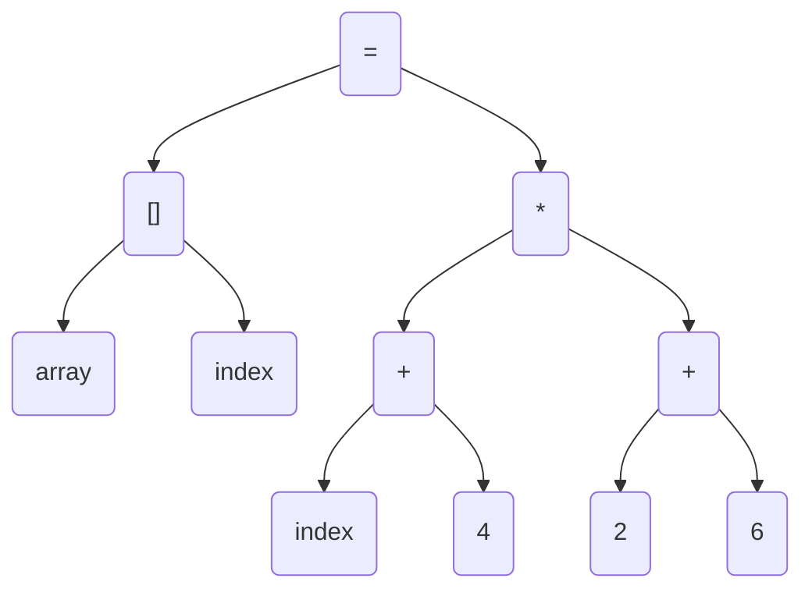

# 基础语法

## 链接
[Markdown语法](https://markdown.com.cn)

## 图片


## 表格

可以使用冒号来定义表格的对齐方式，如下：

| 姓名   | 年龄 |     工作 |
| :----- | :--: | -------: |
| 小可爱 |  18  | 吃可爱多 |
| 小小勇敢 |  20  | 爬棵勇敢树 |
| 小小小机智 |  22  | 看一本机智书 |
## 代码
` curl https://wwww.baidu.com `
## 代码块
```
bash
ls -l
```

## 数学公式
方程组：
$$
\begin{cases}
3x + 2y  = 7 \\
-6x + 6y  = 6 \\
\end{cases}
$$





# sequence
```
sequenceDiagram
    小程序 ->> 小程序 : wx.login()获取code
    小程序 ->> + 服务器 : wx.request()发送code
    服务器 ->> + 微信服务器 : code+appid+secret
    微信服务器 -->> - 服务器 : openid
    服务器 ->> 服务器 : 根据openid确定用户并生成token
    服务器 -->> - 小程序 : token
    
```
```sequence
Title: 标题：复杂使用
对象A->对象B: 对象B你好吗?（请求）
Note right of 对象B: 对象B的描述
Note left of 对象A: 对象A的描述(提示)
对象B-->对象A: 我很好(响应)
对象B->小三: 你好吗
小三-->>对象A: 对象B找我了
对象A->对象B: 你真的好吗？
Note over 小三,对象B: 我们是朋友
participant C
Note right of C: 没人陪我玩
```


